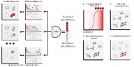

|3.8 badge| |3.9 badge| |3.10 badge| |license badge| |PyPI version|

========
ikarus
========

ikarus is a stepwise machine learning pipeline that tries to cope with a task of distinguishing tumor cells from normal cells.
Leveraging multiple annotated single cell datasets it can be used to define a gene set specific to tumor cells. 
First, the latter gene set is used to rank cells and then to train a logistic classifier for the robust classification of tumor and normal cells.
Finally, sensitivity is increased by propagating the cell labels based on a custom cell-cell network. 
ikarus is tested on multiple single cell datasets to ascertain that it achieves high sensitivity and specificity in multiple experimental contexts.
Please find more information in the corresponding `publication <https://genomebiology.biomedcentral.com/articles/10.1186/s13059-022-02683-1>`_.

  
  
Installation
============
ikarus currently supports :code:`python>=3.8`, and can be installed from PyPI:

::

  pip install ikarus
 
Alterantively, one can install ikarus' master branch directly from github:
 
::

  python -m pip install git+https://github.com/BIMSBbioinfo/ikarus.git
  

Usage
=============
The easiest option to get started is to use the provided Tumor/Normal gene lists and the pretrained model:

::

  from ikarus import classifier
  
  model = classifier.Ikarus(signatures_gmt=signatures_path)
  model.load_core_model(model_path)
  predictions = model.predict(test_adata, 'test_name')
  
 
More information on how to train a model or how to create own gene lists is provided in the tutorial notebook.

..

+----------------------------------------------------+
| Example notebooks                                  |
+====================================================+
| `Data preparation and basic prediction`_           |
+----------------------------------------------------+

.. _`Data preparation and basic prediction`: https://github.com/BIMSBbioinfo/ikarus/blob/master/tutorials/tutorial.ipynb
.. |3.8 badge| image:: https://github.com/BIMSBbioinfo/ikarus/actions/workflows/python-package-3.8.yml/badge.svg
    :target: https://github.com/BIMSBbioinfo/ikarus/actions/workflows/python-package-3.8.yml
.. |3.9 badge| image:: https://github.com/BIMSBbioinfo/ikarus/actions/workflows/python-package-3.9.yml/badge.svg
    :target: https://github.com/BIMSBbioinfo/ikarus/actions/workflows/python-package-3.9.yml
.. |3.10 badge| image:: https://github.com/BIMSBbioinfo/ikarus/actions/workflows/python-package-3.10.yml/badge.svg
    :target: https://github.com/BIMSBbioinfo/ikarus/actions/workflows/python-package-3.10.yml
.. |license badge| image:: https://img.shields.io/badge/License-MIT-yellow.svg
    :target: https://opensource.org/licenses/MIT
.. |PyPI version| image:: https://badge.fury.io/py/ikarus.svg
    :target: https://pypi.org/project/ikarus/
